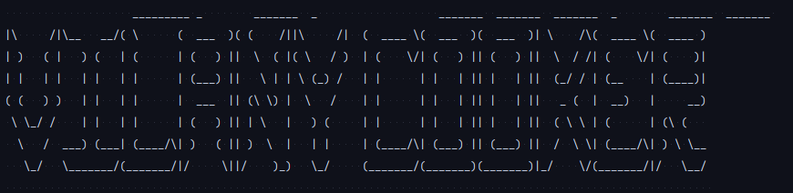

# Vilany

Mimics the behavior of a real rice cooker through command line interface.

#### It has been implemented in 4 different languages
- [Kotlin](https://github.com/hei-school/cc-d4-rice-cooker-ci-YumeT023/tree/feature/kotlin)
- [Javascript](https://github.com/hei-school/cc-d4-rice-cooker-ci-YumeT023/tree/feature/javascript)
- [Elixir](https://github.com/hei-school/cc-d4-rice-cooker-ci-YumeT023/tree/feature/elixir)
- C
### Features

- [x] Plug/Unplug
- [x] Open/Close the lid of the rice cooker
- [ ] Place raw food into the inner pot of the rice cooker
  - [x] rice
  - [ ] other kind of food   
- [x] interactive timer while waiting
- [ ] Set cooking mode and timer
  - [x] Cook
  - [ ] Keep warm
  - [ ] Steamer
- [x] Get the ready-to-serve cook (Emptying the pot)
- [x] Begin the cooking process
